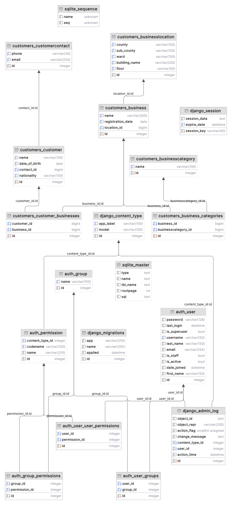

# Jambo-customers

Customer registration API.

## Run the tests

1. `pip install --upgrade --upgrade-strategy=eager pip` - upgrade package manager.
2. `pip install --upgrade --upgrade-strategy=eager -r requirements-dev.txt` - install dependencies.
3. `py.test` - run the tests.

## Starting the server

Run the following commands in order of listing:

1. `pip install --upgrade --upgrade-strategy=eager pip` - upgrade package manager.
2. `pip install --upgrade --upgrade-strategy=eager -r requirements-dev.txt` - install dependencies.
3. `python manage.py migrate` - creates the database file and tables.
4. `python manage.py runserver` - starts the server.

Go to http://localhost:8000/docs/ to access the available APIs.

## Database Design Diagram

